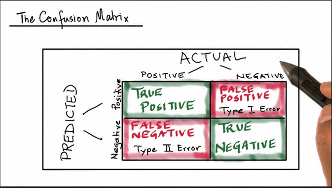

Confusion Matrix  

A Confusion Matrix  is an N x N matrix that is often used to summarize the performance of a classification model. 
It helps by giving us a better idea of what out classification model is predicting right and what the type of errors it is making. The number of correctly and incorrectly predicted values are summarized and stored in the table against the actual values as shown

* TP: true positive
* TN: True Negative
* FP: False positive (type 1 error)
 A test result which wrongly indicates that a particular condition or attribute is present. e.g A doctor claiming that a patient is pregnant but is not.
* FN: False negative (type 2 error)
A test result which wrongly indicates that a particular condition or attribute is absent. e.g A doctor claiming that a patient is not pregnant when they actually are.(See Figure:1)

-	Accuracy : shows how ofter the classifier was correct
Accuracy = (TP+TN)/(TP+TN+FN+FP)  

  

-	Precision : how many selected items are relevant
Precision = TP/(TP+FP)

-	Recall / Sensitivity / True Positive Rate : how many relevant items are selected
Recall(TPR) = TP/(TP+FN)
-	Specificity / TNR (true negative rate) :
TNR = TN/(TN+FP)

+ ROC
+ AUC

Classification model evaluation metrics :
- Kolmogorov Smirnov test
- Gain and Lifts
- F Scores 
