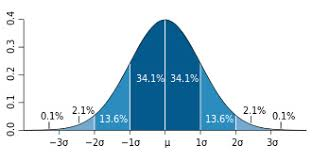

Normal distributions have the following features:

symmetric bell shape
mean and median are equal; both located at the center of the distribution

* ~68% of the data falls within 1 standard deviation of the mean
* ~95%of the data falls within 2 standard deviations of the mean
* ~99.7% of the data falls within 3 standard deviations of the mean

