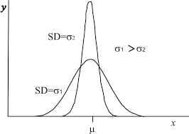
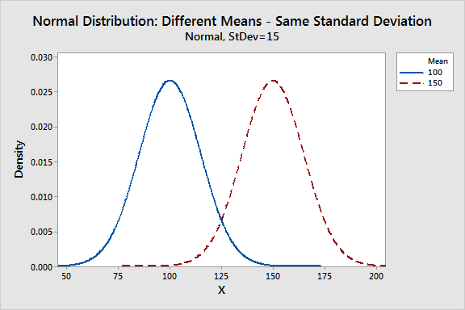

standard deviation 

In statistics, the standard deviation (SD, also represented by the lower case Greek letter sigma σ or the Latin letter s) is a measure that is used to quantify the amount of variation or dispersion of a set of data values.[1]  

A low standard deviation indicates that the data points tend to be close to the mean (also called the expected value) of the set,  

while a high standard deviation indicates that the data points are spread out over a wider range of values. 


The standard deviation of a random variable, statistical population, data set, or probability distribution is the square root of its variance. It is algebraically simpler, though in practice less robust, than the average absolute deviation.[2][3] A useful property of the standard deviation is that, unlike the variance, it is expressed in the same units as the data. 

En mathématiques, l’écart type (aussi orthographié écart-type) est une mesure de la dispersion des valeurs d'un échantillon statistique ou d'une distribution de probabilité. Il est défini comme la racine carréede la variance ou, de manière équivalente, comme la moyenne quadratique des écarts par rapport à la moyenne. Il se note en général avec la lettre grecque σ (« sigma »), d’après l’appellation standard deviation en anglais 

two distributions with the same means but two different standard-deviations 


two distributions with the same standard-deviations but two different means




## z-score :
```math
$$z= (x-mean)/standard-deviation$$
\sigma
````

Here are some important facts about z-scores:
A positive z-score says the data point is above average.
A negative z-score says the data point is below average.
A z-score close to 000 says the data point is close to average.
A data point can be considered unusual if its z-score is above 333 or below -3−3minus, 3.


## Correlation Coefficient r
r in [-1,1]
a measure of how well a line can describe the relationship between x and y
r = 1/(n-1) * sum(z-score(xi) * z-score(yi))
r > 0 : up slipping line 
r < 0 : down slipping line 
r = 0 :

Strong positive linear relationships have values of rrr closer to 111.
Strong negative linear relationships have values of rrr closer to -1−1minus, 1.
Weaker relationships have values of rrr closer to 000.


##
infering population mean from sample mean : 


# Central limit Theorem
as a sample size gets to infinity
the means of the different samples follow a normal distribution
even if the population distribution doesn't necesserly follows a normal distribution

## sampling distribution fo the sample mean

how normal a distribution is : 
- skew : pos/neg skew
- kurtosis : 
  * positive: fater tails and pointy peaks
  * negative: smaller tails and smoother near the middle


how our ditribution changes with 
the bigger n
- lower sd, skew and kurtosis

variance_sub_mean = variance / n (var=sd^2)
sd_mean = sd/sqrt(n)
